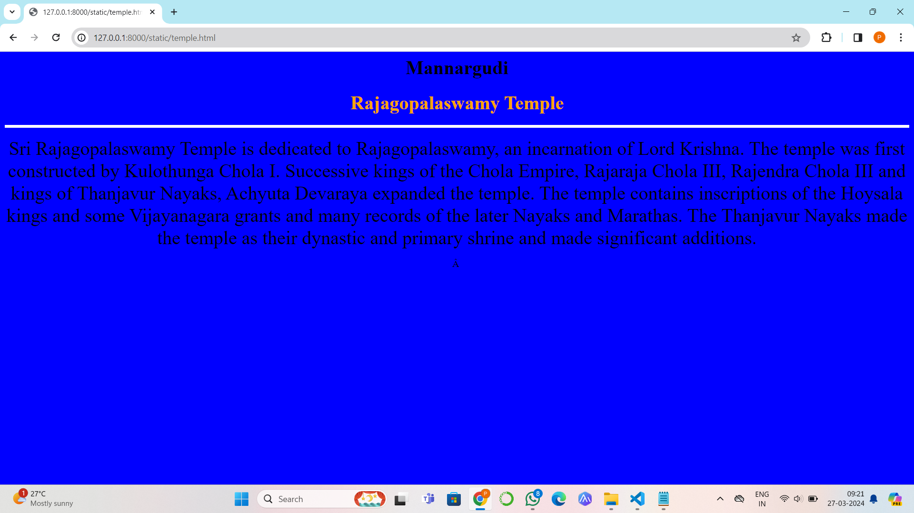
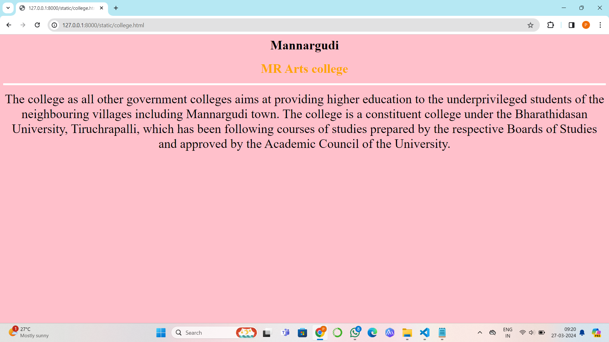
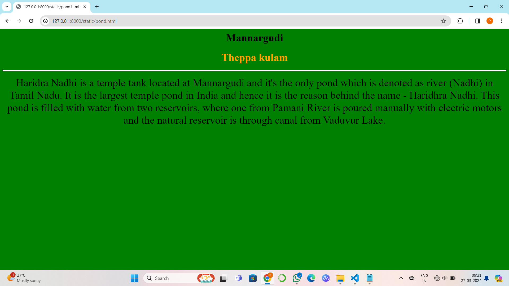
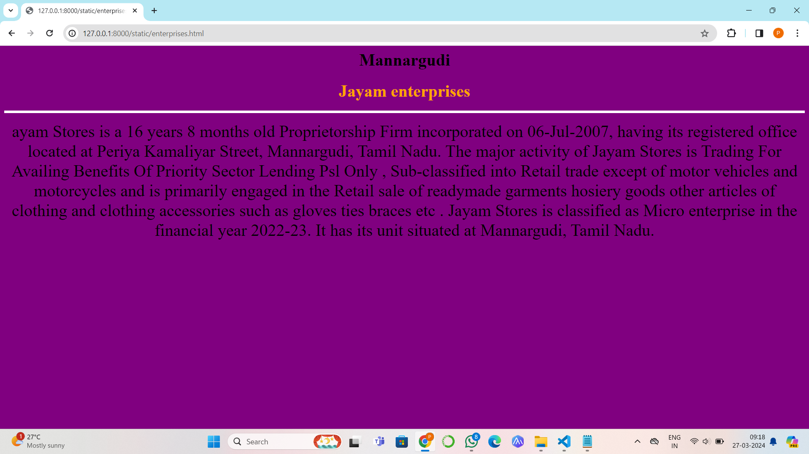
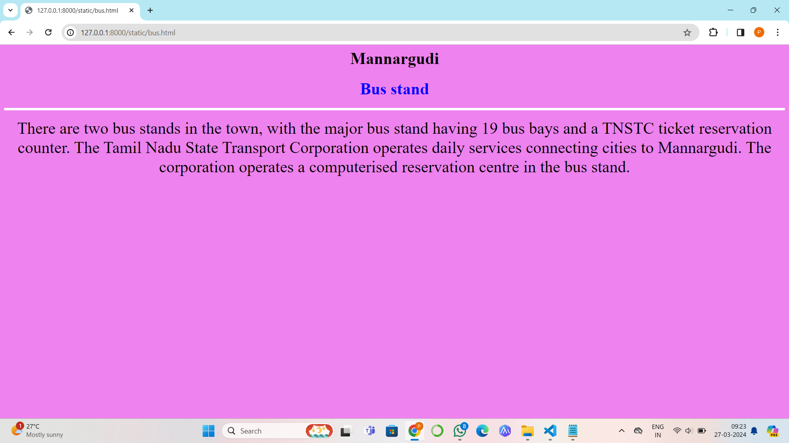

# Ex04 Places Around Me
## Date: 20/03/2024

## AIM
To develop a website to display details about the places around my house.

## DESIGN STEPS

### STEP 1
Create a Django admin interface.

### STEP 2
Download your city map from Google.

### STEP 3
Using ```<map>``` tag name the map.

### STEP 4
Create clickable regions in the image using ```<area>``` tag.

### STEP 5
Write HTML programs for all the regions identified.

### STEP 6
Execute the programs and publish them.

## CODE
```
map.html
<html>
    <title>Mycity</title>
    <body bgcolor="white">
        <h1 align="center"><font color="black">Mannargudi</font></h1>
        <h3 align="center">
            <font color="blue">Pavithra S(212223220050)</font></h3>
        <center>
            
            <map name="MyCity">
                    <area shape="rect" coords="400,360,540,500" href="Temple.html" title="Rajagopalaswamy temple">     
                    <area shape="rect" coords="300,240,400,360" href="pond.html" title="Theppa kulam">
                    <area shape="rect" coords="350,280,450,400" href="college.htnl" title="MR arts college">
                    <area shape="rect" coords="280,340,400,350" href="Bus.html" title="Mannargudi Bus stand">
                    <area shape="rect" coords="420,380,500,450" href="Enterprises.html" title=" Jayam Enterprises">
            </map>
        </center>
       

   </body>
</html>

temple.html
<html>
    <h1 align="center">
        <font face="Times New Roman" color="black" size="6">Mannargudi</font>
    </h1>
    <h3 align="center">
        <font face="Times New Roman" color="orange" size="6.3">Rajagopalaswamy Temple</font>
    </h3>
    <body bgcolor="Blue" align="center">
        <hr size="5" color="white">
        <p align="center">
        <font face="Times New Roman" size="6">
            Sri Rajagopalaswamy Temple is dedicated to Rajagopalaswamy, an incarnation of Lord Krishna. The temple was first constructed by Kulothunga Chola I. Successive kings of the Chola Empire, Rajaraja Chola III, Rajendra Chola III and kings of Thanjavur Nayaks, Achyuta Devaraya expanded the temple. The temple contains inscriptions of the Hoysala kings and some Vijayanagara grants and many records of the later Nayaks and Marathas. The Thanjavur Nayaks made the temple as their dynastic and primary shrine and made significant additions.
  
        </font>
        </p>
   </body>
</html>

college.html
<html>
    <h1 align="center">
        <font face="Times New Roman" color="black" size="6">Mannargudi</font>
    </h1>
    <h3 align="center">
        <font face="Times New Roman" color="orange" size="6.3">MR Arts college</font>
    </h3>
    <body bgcolor="Pink" align="center">
        <hr size="5" color="white">
        <p align="center">
        <font face="Times New Roman" size="6">
            The college as all other government colleges aims at providing higher education to the underprivileged students of the neighbouring villages including Mannargudi town. The college is a constituent college under the Bharathidasan University, Tiruchrapalli, which has been following courses of studies prepared by the respective Boards of Studies and approved by the Academic Council of the University.
        </p>
   </body>
</html>
pond.html
<html>
    <h1 align="center">
        <font face="Times New Roman" color="black" size="6">Mannargudi</font>
    </h1>
    <h3 align="center">
        <font face="Times New Roman" color="orange" size="6.3">Theppa kulam</font>
    </h3>
    <body bgcolor="Green" align="center">
        <hr size="5" color="white">
        <p align="center">
        <font face="Times New Roman" size="6">
            Haridra Nadhi is a temple tank located at Mannargudi and it's the only pond which is denoted as river (Nadhi) in Tamil Nadu. It is the largest temple pond in India and hence it is the reason behind the name - Haridhra Nadhi. This pond is filled with water from two reservoirs, where one from Pamani River is poured manually with electric motors and the natural reservoir is through canal from Vaduvur Lake.
  
        </font>
        </p>
   </body>
</html>
Enterprises.html
<html>
    <h1 align="center">
        <font face="Times New Roman" color="black" size="6">Mannargudi</font>
    </h1>
    <h3 align="center">
        <font face="Times New Roman" color="orange" size="6.3">Jayam enterprises</font>
    </h3>
    <body bgcolor="Purple" align="center">
        <hr size="5" color="white">
        <p align="center">
        <font face="Times New Roman" size="6">
            ayam Stores is a 16 years 8 months old Proprietorship Firm incorporated on 06-Jul-2007, having its registered office located at Periya Kamaliyar Street, Mannargudi, Tamil Nadu.
            The major activity of Jayam Stores is Trading For Availing Benefits Of Priority Sector Lending Psl Only , Sub-classified into Retail trade except of motor vehicles and motorcycles and is primarily engaged in the Retail sale of readymade garments hosiery goods other articles of clothing and clothing accessories such as gloves ties braces etc .
            Jayam Stores is classified as Micro enterprise in the financial year 2022-23. It has its unit situated at Mannargudi, Tamil Nadu.
        </p>
    </body>
</html>            
Bus.html
<html>
    <h1 align="center">
        <font face="Times New Roman" color="black" size="6">Mannargudi</font>
    </h1>
    <h3 align="center">
        <font face="Times New Roman" color="blue" size="6.3">Bus stand</font>
    </h3>
    <body bgcolor="Violet" align="center">
        <hr size="5" color="white">
        <p align="center">
        <font face="Times New Roman" size="6">
            There are two bus stands in the town, with the major bus stand having 19 bus bays and a TNSTC ticket reservation counter. The Tamil Nadu State Transport Corporation operates daily services connecting cities to Mannargudi. The corporation operates a computerised reservation centre in the bus stand.
        </font>
        </p>
   </body>
</html>
```
## OUTPUT






## RESULT
The program for implementing image maps using HTML is executed successfully.
